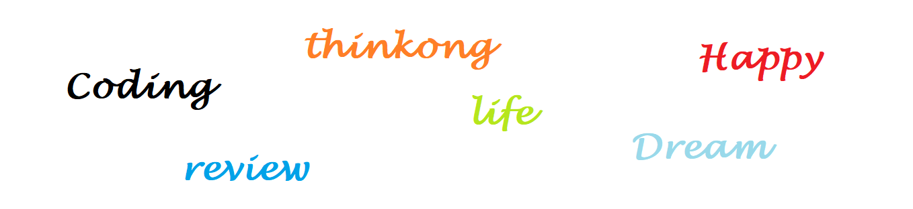

/*`--------------------------------------P  A  R  T  1--------------------------------------`

### `Accept Code`

```cpp */
#include<iostream>
int main()
{
	std::cout << "Code Area" << std::endl;
    return 0;
}
/*
```

*//*`--------------------------------------P  A  R  T  2-------------------------------------`

### `Test Run`
##### `Sample input`
> test Sample
##### `Run Result`
> 

`------------------------------------------P  A  R  T  3-------------------------------------`

### `A N A L Y Z E`
##### `Involved with knowledge and skill`
> + contentArea
##### `Problem-solving ideal`
> + contentArea
##### `Time complexity`
> + contentArea
##### `Space complexity`
> + contentArea
##### `Reference:`
> + [AC-Online-Judge](https://github.com/Sunrisepeak/AC-Online-Judge)

*/

