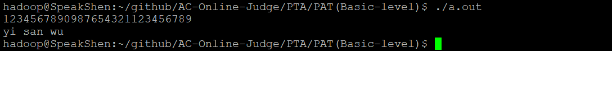

/*`--------------------------------------P  A  R  T  1--------------------------------------`
### `Accept Code`

```cpp */
#include<iostream>
#include<string>
#include<map>
int sum_bit(std::string str)
{
    int sum{0};
    for(auto c : str)
    {
        sum += c - '0';     //calulater sum to bit of str
    }
    return sum;

}

int main()
{
    std::map<int, std::string> num_pingyin{
            {0, "ling"},
            {1, "yi"},
            {2, "er"},
            {3, "san"},
            {4, "si"},
            {5, "wu"},
            {6, "liu"},
            {7, "qi"},
            {8, "ba"},
            {9, "jiu"}
    };	//0-9 and its spell
    std::string num_str{""};//save input(c++11 init list)
    std::cin >> num_str;    //read
    std::string sum_str = std::to_string(sum_bit(num_str));  //sum tostring
    for(decltype(sum_str.size()) i = 0; i < sum_str.size(); i++)
    {
        int num = sum_str[i] - '0';   //get num(0~9) every unit
        std::cout << num_pingyin[num] <<
                     (i + 1u != sum_str.size() ? " " : "\n");    //deal space_key in the end
    }
    return 0;
}
/*
```

*//*`--------------------------------------P  A  R  T  2-------------------------------------`

### `Test Run`
##### `Sample input`
> 1234567890987654321123456789
##### `Run Result`
> 

`------------------------------------------P  A  R  T  3-------------------------------------`

### `A N A L Y Z E`
##### `Involved with knowledge and skill`
> + stl : map<type, type> key_value
> + decltype(funcOrvariable) accroding to funcOrvariable inferr to Type.
> + string : to_string() int to string
> + (i + 1u) != sum_str.size() ? " " : "\n") deal space in a line end
##### `Problem-solving ideal`
> + Because of input is large number so to use string read and transform to number by ` num_str[i] ` 
> + to index bit of the number of string type. In the process, using `'char' - '0'` of formal to int.
> + Eventually,return the sum of every bit of input number. using once again transform to string by 
> + `tostring()`. it is let our simple get every bit of `sum`(by index of string) then use a `for()`
> + to print 'pingyi' match with it that to use `map`.
##### `Time complexity`
> + O(n)
##### `Space complexity`
> + O(n)
##### `Reference:`
> + [AC-Online-Judge](https://github.com/Sunrisepeak/AC-Online-Judge)
> + [Problem Address](https://pintia.cn/problem-sets/994805260223102976/problems/994805324509200384)

*/
